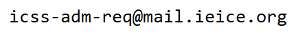

## お知らせ
- [【CFP】英文論文誌：情報通信システムセキュリティ小特集(2026/06発刊)の投稿締切を6/24(火)に延長しました](#cfp%E8%8B%B1%E6%96%87%E8%AB%96%E6%96%87%E8%AA%8C%E6%83%85%E5%A0%B1%E9%80%9A%E4%BF%A1%E3%82%B7%E3%82%B9%E3%83%86%E3%83%A0%E3%82%BB%E3%82%AD%E3%83%A5%E3%83%AA%E3%83%86%E3%82%A3%E5%B0%8F%E7%89%B9%E9%9B%86202606%E7%99%BA%E5%88%8A)
- [2024年度ICSS研究賞受賞論文を掲載しました(2025/04/25)](award.html)
- [第72回合同研究会(Security Summer Summit)を札幌コンベンションセンター（北海道札幌市）で開催します](#%E7%AC%AC72%E5%9B%9E%E5%90%88%E5%90%8C%E7%A0%94%E7%A9%B6%E4%BC%9Asecurity-summer-summit%E3%82%92%E9%96%8B%E5%82%AC%E3%81%97%E3%81%BE%E3%81%99)
- [【CFP】英文論文誌：情報通信システムセキュリティ小特集(2026/06発刊)の投稿論文を募集します](#cfp%E8%8B%B1%E6%96%87%E8%AB%96%E6%96%87%E8%AA%8C%E6%83%85%E5%A0%B1%E9%80%9A%E4%BF%A1%E3%82%B7%E3%82%B9%E3%83%86%E3%83%A0%E3%82%BB%E3%82%AD%E3%83%A5%E3%83%AA%E3%83%86%E3%82%A3%E5%B0%8F%E7%89%B9%E9%9B%86202606%E7%99%BA%E5%88%8A)
- ICSS研が協賛する[AsiaJCIS2025](https://asiajcis2025.sch.ac.kr/)が2025/08/12～12に韓国ソウルで開催されます
- ICSS研が協賛する[CANS2025](https://cy2sec.comm.eng.osaka-u.ac.jp/miyaji-lab/event/cans2025/index.html)が2025/11/17～20にグランキューブ大阪(大阪府大阪市)で開催されます
-  [第73回ICSS研究会を遊学館（山形県山形市）で開催します](#%E7%AC%AC73%E5%9B%9Eicss%E7%A0%94%E7%A9%B6%E4%BC%9A%E3%82%92%E9%96%8B%E5%82%AC%E3%81%97%E3%81%BE%E3%81%99)

過去のお知らせ

 - [第71回ICSS/IA合同研究会を広島大学 東千田キャンパス（広島県広島市）で開催しました](#%E7%AC%AC71%E5%9B%9Eicssia%E5%90%88%E5%90%8C%E7%A0%94%E7%A9%B6%E4%BC%9A%E3%82%92%E9%96%8B%E5%82%AC%E3%81%97%E3%81%BE%E3%81%99)
 - [第70回ICSS/SPT合同研究会(2025年3月:沖縄県那覇市)を開催しました](https://ken.ieice.org/ken/program/index.php?tgs_regid=7d40e0d1fbc823c402c27c393bae23134140f3b86336e69dc2ce7ec212b50b80&tgid=IEICE-ICSS)
 - ICSS研が後援するイベント[NICTサイバーセキュリティシンポジウム2025](https://www.d-wks.net/nict250221/)が開催されました
 - ICSS研が後援する国際会議[MobiSec2024](https://www.manuscriptlink.com/society/kiisc/conference/mobisec2024)が12/17-19に札幌で開催されました
 - [第69回研究会(2024年11月:神奈川県川崎市)を開催しました](https://ken.ieice.org/ken/program/index.php?tgs_regid=4fe41e6d4800ad057d36fb5953d3ef6616391a1566180a1533aedac4d798f8a1&tgid=IEICE-ICSS) 
 - [第68回合同研究会「通称:Security Summer Summit」(2024年7月:北海道札幌市)を開催しました](https://ken.ieice.org/ken/program/index.php?tgs_regid=a235a62f0d6c0e842fbf7480f5b60c882e57a9f722c881fb245e8ec553a2b493&tgid=IEICE-ICSS)
 - [第67回ICSS/IA合同研究会(2024年6月:岡山県岡山市)を開催しました](https://ken.ieice.org/ken/program/index.php?tgs_regid=0efcbb324f8e24f57bdb4f8f7f5f04e5c0b7594aa0032a8855592b2c389451f0&tgid=ICSS)
 - [第66回ICSS/SPT合同研究会(2024年3月:沖縄県恩納村)を開催しました](https://ken.ieice.org/ken/program/index.php?tgs_regid=a625c6a296493252a4f2a9b3f76c0b924d9b37fc6efbfdc33610035332047971&tgid=IEICE-ICSS)
 - ICSS研が協催する[暗号と情報セキュリティシンポジウム2024(SCIS2024)](https://www.iwsec.org/scis/2024/)が開催されました
 - [第65回研究会(2023年11月:石川県金沢市)を開催しました](https://ken.ieice.org/ken/program/index.php?tgs_regid=91320db077704f64057184451e848bb989a473560c14bea1f79efc34a67ae0f0&tgid=IEICE-ICSS)
 - [第64回合同研究会「通称:Security Summer Summit」(2023年7月:北海道札幌市)を開催しました](https://ken.ieice.org/ken/program/index.php?tgs_regid=3d8f0b8b4c5b42e831838e7283fce5e7f479a15b0c31f5a6ce5e9a4a2cd4c966&tgid=IEICE-ICSS)
 - [第63回ICSS/IA合同研究会(2023年6月:佐賀県佐賀市)を開催しました](https://ken.ieice.org/ken/program/index.php?tgs_regid=58f8ecb0eeaad4eacaba3d2d8b7acd75963042fceac1dcae650e83b1909921ac&tgid=IEICE-ICSS)
 - [2022年度ICSS研究賞受賞論文を掲載しました(2023/05/16)](award.html)
 - ICSS研究会Webページをリニューアルしました(2023/05/08)

## 第72回合同研究会(Security Summer Summit)を開催します

### 開催概要

|日程|2025/07/07(月)-09(水)|
|会場|[札幌コンベンションセンター](https://www.sora-scc.jp/)（北海道札幌市）|
|テーマ|セキュリティ、一般|
|共催|BioX, EMM, HWS, ISEC, SITE|
|連催|IPSJ-CSEC, IPSJ-SPT|

- [開催プログラム](https://ken.ieice.org/ken/program/index.php?mode=program&tgs_regid=7a8413451964447d206e23030452f432947c8e4709d99910ec06cb619c1464ba&tgid=ICSS)
- [研究会に参加(発表・聴講)するには](#%E7%A0%94%E7%A9%B6%E4%BC%9A%E3%81%AB%E5%8F%82%E5%8A%A0%E7%99%BA%E8%A1%A8%E8%81%B4%E8%AC%9B%E3%81%99%E3%82%8B%E3%81%AB%E3%81%AF)

### スケジュール
- [x] 発表申込締切:2025/05/12(月)
- [ ] 原稿提出締切:2025/06/09(月)ごろ
- [ ] 研究会開催日:2025/07/07(月)-09(水)

### 注意事項
- 発表は現地参加のみを予定しています。
- 事前に参加費をお支払いのうえ、ご参加ください。

## 第73回ICSS研究会を開催します

### 開催概要

|日程|2025/11/04(火)-05(水)|
|会場|[遊学館](https://www.gakushubunka.jp/yugakukan/)（山形県山形市）|
|テーマ|セキュリティ、一般|

- [開催プログラム](https://ken.ieice.org/ken/program/index.php?instsoc=&tgid=IEICE-ICSS&year=0&region=0&sch1=1&schkey=&pnum=0&psize=2&psort=0&layout=&lang=&term=&pskey=&ps1=1&ps2=1&ps3=1&ps4=1&ps5=1&search_mode=)
- [研究会に参加(発表・聴講)するには](#%E7%A0%94%E7%A9%B6%E4%BC%9A%E3%81%AB%E5%8F%82%E5%8A%A0%E7%99%BA%E8%A1%A8%E8%81%B4%E8%AC%9B%E3%81%99%E3%82%8B%E3%81%AB%E3%81%AF)

### スケジュール
- [ ] 発表申込締切:2025/09/09(火)
- [ ] 原稿提出締切:2025/10/14(火)
- [ ] 研究会開催日:2025/11/04(火)-05(水)

### 注意事項
- 発表は現地参加のみを予定しています。
- 事前に参加費をお支払いのうえ、ご参加ください。

## 【CFP】英文論文誌：情報通信システムセキュリティ小特集(2026/06発刊)

### スケジュール
- 投稿締切:2025/06/24(火) 延長しました
- 発行予定:2026/06

### 詳細
[CFPの詳細はこちらをご覧ください(PDFファイル)](https://www.ieice.org/eng/s_issue/cfp/2026_6ED.pdf)

## 今後の研究会日程

### [研究会発表申込システム(ICSS研究会 開催スケジュール)](https://ken.ieice.org/ken/program/index.php?tgid=ICSS)

### 第71回ICSS/IA合同研究会
- 日程:2025/06/23(月)-24(火)
- 会場:広島大学 東千田キャンパス（広島県広島市）
- 共催:IA

### 第72回合同研究会(通称:Security Summer Summit)
- 日程:2025/07/07(月)-09(水)
- 会場:札幌コンベンションセンター
- 共催:BioX, EMM, HWS, ISEC, SITE
- 連催:IPSJ-CSEC, IPSJ-SPT

### 第73回ICSS研究会
- 日程:2025/11/04(火)-05(水)
- 会場:遊学館（山形県山形市）

### 第74回ICSS/IPSJ-SPT合同研究会
- 日程:2026/03/DD
- 会場:沖縄県(予定)
- 連催:IPSJ-SPT

## 研究会に参加(発表・聴講)するには
- [研究会を聴講したい](https://www.ieice.org/jpn_r/event/kenkyukai/index.html?id=choko)
- [研究会で発表したい](https://www.ieice.org/jpn_r/event/kenkyukai/index.html?id=happyo)
  - ICSS研究会の原稿枚数は**6枚以上推奨、8枚以下**です。
  - ICSS研究会(情報・システムソサイエティ)では、発表参加費は不要です。(別途、聴講参加費が必要)
- [研究会に関するFAQ](https://www.ieice.org/jpn_r/faq/kenkyuukai.html)
- 聴講参加費について
  - 発表者（登壇者1名）
    - 発表申し込み時に登録いただいたメールアドレスに発表者の参加費についてのメールが信学会から届きますので、必要に応じてお支払いお願い致します。
  - 聴講参加者・登壇者1名以外
    - 学生かつ予稿集が不要な場合、聴講参加費は無料です。
    - それ以外の場合の聴講参加費は、[こちら](https://www.ieice.org/jpn_r/event/kenkyukai/entry_fee.html?id=iss)を参照してください。

## リンク集
### ICSS研究会について
- [ICSS研について](about.html)
- [ICSS研専門委員会](committee.html)
- [ICSS研究賞](award.html)
- [メーリングリスト](ml.html)

### 共催・連催研究会(アルファベット順)
- [バイオメトリクス(BioX)研究会](https://biox.jp/)
- [マルチメディア情報ハイディング・エンリッチメント(EMM)研究会](https://www.ieice.org/iss/emm/)
- [ハードウェアセキュリティ(HWS)研究会](https://www.ieice.org/~hws/top)
- [インターネットアーキテクチャ(IA)研究会](https://www.ieice.org/cs/ia/jpn/doku.php)
- [情報セキュリティ(ISEC)研究会](https://www.ieice.org/~isec/)
- [技術と社会･倫理(SITE)研究会](https://www.ieice.org/~site/)
- [情報処理学会 コンピュータセキュリティ(CSEC)研究会](https://www.iwsec.org/csec/)
- [情報処理学会 セキュリティ心理学とトラスト(SPT)研究会](https://info.spt.ipsj.or.jp/)

## 問い合わせ
ICSS研究会に関するお問い合わせは、以下の連絡先（幹事団）までお願いいたします。

