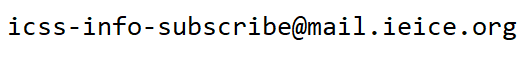
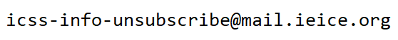
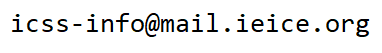

# ICSS研究会メーリングリストについて

ICSS研が主催する研究会、論文誌募集などの情報を中心に配信します。
その他、ICSS研の研究テーマに関する情報を配信しています。

### 購読方法

ICSS研究会メーリングリストを購読される場合は

1. 購読したいメールアドレスから、以下の購読アドレスに空メールを送ります
2. 購読確認メールが送信されるので、そのメールの指示に従って返信します
3. 購読処理が完了すると、購読が完了した旨のメールが送信されます

### 退会方法

ICSS研究会メーリングリストから退会される場合は

1. 退会したいメールアドレスから、以下の退会アドレスに空メールを送ります
2. 退会確認メールが送信されるので、そのメールの指示に従って返信します
3. 退会処理が完了すると、退会が完了した旨のメールが送信されます

### メーリングリストにメールを配信をしたい

ICSS研究会メーリングリストに配信したい場合は、以下のメーリングリストアドレスにメールを送信してください。

送信されたメールは、ICSS研の幹事団が確認・承認した後に配信されます。

### メールアドレスの取扱いについて

ICSS研究会メーリングリストに登録されたメールアドレスは、メーリングリストの配信にのみ使用します。
